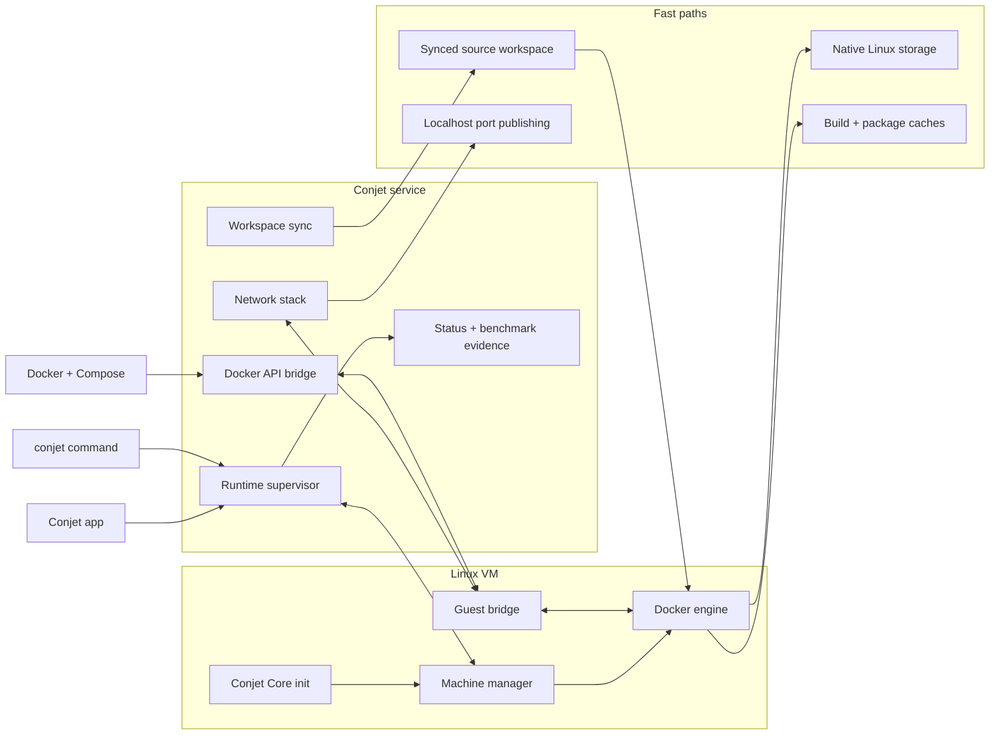

# Conjet Architecture

Conjet starts as a shared Linux VM with a thin Swift CLI, the `conjetd` runtime
daemon, a Unix-domain control socket, and native-Linux storage for container hot
paths.

The first implemented surface is intentionally small:

- `conjet doctor` records host capabilities.
- `conjetd` exposes `ping`, `status`, and `stop` over `~/.conjet/run/conjetd.sock`;
  legacy `Conjet Core` and `conjet-core` process names are recognized only for cleanup of older installs.
- `conjetd` owns VM lifecycle commands over that socket: `vm-start`,
  `vm-stop`, and `vm-status`.
- `ConjetBench` records repeatable benchmark JSON.
- `PathClassifier` encodes the first ConjetFS placement policy.
- `ConjetFS` project attach syncs host-authoritative files into a Docker
  volume mounted at `/workspace`, giving containers a native-Linux workspace
  for dependency and build churn.
- `EnergyGovernor` encodes `performance`, `balanced`, and `eco` policies for
  VM CPU caps, event batching, network reconciliation, and persistence cadence.

## Backend Backbone

The current backend is three layers: a small macOS control plane, an Apple
Virtualization.framework transport/storage plane, and a Linux guest runtime.
Docker compatibility stays at the host-facing edge, while dependency, build,
image, and container state churn stay on Linux-native storage.

The backbone responsibilities are:

- `conjet` stays thin. It starts or asks Conjet Core for VM lifecycle work,
  configures Docker context `conjet`, and routes Docker-compatible commands to
  the Conjet socket instead of embedding a second Docker client.
- Conjet Core owns the stateful host surfaces: VM lifecycle, Docker socket
  bridging, published-port forwarding, network repair, cached status, and
  orderly guest Docker quiesce on stop.
- The VZ substrate supplies the hard isolation and low-level transport:
  EFI-booted Conjet Core disk, separate data disk, NAT, VSOCK, serial logs, and
  VirtioFS bootstrap/host shares.
- The guest owns container runtime state. Docker, containerd, BuildKit, the
  compiled `conjet-netd` helper, the Python fallback bridge, service lifecycle
  markers, and boot diagnostics live inside Conjet Core.
- ConjetFS owns the fast development workspace path. It synchronizes
  host-authoritative source into a Docker volume mounted at `/workspace`, while
  dependency directories, package caches, and build outputs remain VM-native
  unless explicitly exported.

This architecture is fast for concrete reasons, not because the host socket is
special by itself:

- Write-heavy container state stays on the guest data disk. `/var/lib/docker`
  and `/var/lib/containerd` are bound onto the Conjet data disk, so image
  extraction, layer writes, BuildKit state, and container metadata avoid
  repeated macOS filesystem crossings.
- Project hot paths avoid strict bind-mount churn. ConjetFS copies only
  source-authoritative files and records signatures, so later pushes copy
  changed paths and delete removed synced files without touching VM-native
  `node_modules`, package stores, Cargo `target`, Go caches, or generated build
  trees.
- Small edit loops have short synchronization paths. `sync watch` uses FSEvents
  by default, batches with a debounce, and can stream small updates through a
  helper or tar payload before falling back to bulk staging.
- Docker API compatibility is preserved through a bounded bridge. The host
  Docker socket has a deep accept backlog, parses create/start requests only far
  enough to prepublish ports, forwards bytes over VSOCK, and returns HTTP 503
  when the guest is not ready instead of silently falling through to another
  runtime.
- Published-port setup avoids broad sweeps on hot paths. Create/start intent
  caches, Docker event watching, container-target snapshots, and targeted
  inspect calls let Conjet attach listeners close to container start while
  keeping periodic reconcile as a repair path.
- Network proxy work is capability-gated. The default `auto` proxy selects the
  measured DispatchSource path today, keeps SwiftNIO available for comparison,
  and uses binary/persistent guest paths only when the active guest bridge
  advertises them.
- Read-only status is cached and invalidated around state changes. Bursty CLI
  probes do not repeatedly walk VM state, manifest files, Docker socket state,
  and forwarding tables.
- Conjet Core owns the Conjet Pulse event fabric. CLI commands, VM lifecycle
  changes, Docker runtime events, and repair operations append monotonic events
  to a bounded in-memory log. GUI clients take an initial snapshot, subscribe
  over the same Unix-domain socket, and reconnect by sequence number so missed
  durable events can be replayed or escalated to one snapshot refresh.
- Runtime event ingestion is native and blocking. The daemon consumes Docker's
  `/events` API directly over the Conjet Docker Unix socket, without launching
  an extra Docker CLI process. When the socket is absent, the adapter does not
  run; when the stream is connected, the thread sleeps inside the kernel until
  Docker emits a lifecycle event.

The benchmark rule is part of the architecture: call a path "fast" only for the
measured topology, cache mode, sample count, and baseline that produced the raw
JSON evidence. Warm dev-loop wins do not prove cold/no-cache or energy
superiority.

## VM Boot Substrate

The VZ layer now manages:

- manifest at `~/.conjet/state/vm/manifest.json`
- sparse raw root/data disks
- serial log at `~/.conjet/logs/vm-serial.log`
- bootstrap VirtioFS share at `~/.conjet/state/vm/bootstrap`
- NAT network device
- virtio socket device for the future guest agent
- gzip-compressed `newc` initramfs generation from a supplied static Linux
  `/init` binary
- EFI disk boot through `VZEFIBootLoader` with an owned EFI variable store
- optional cloud-init NoCloud seed ISO attached as a read-only disk
- compressed raw EFI disk import for Conjet Core `.raw.gz` guest artifacts
- Docker API forwarding from `~/.conjet/run/docker.sock` to guest VSOCK port
  2375 after VM start
- optional VirtioFS host shares for `/Users`, plus explicit opt-in `/Volumes`
  sharing, exposed as `conjethostusers` and `conjethostvolumes`, so the guest
  Docker daemon can resolve normal macOS bind-mount source paths

`conjet vm fetch-fedora` and `conjet vm fetch-alpine` are boot-asset fetchers,
not complete container-runtime images. The smoke-test blocker is now concrete:
the downloaded Fedora and Alpine `vmlinuz` files are compressed ARM64 EFI
zboot artifacts, while the current boot path uses `VZLinuxBootLoader`. Conjet
records that boot artifact kind in the manifest and rejects it before calling
Virtualization.framework.

There are now two viable boot lanes:

1. Direct kernel: `conjet vm init --kernel PATH --initrd PATH` uses
   `VZLinuxBootLoader` and expects a direct ARM64 Linux `Image`/`vmlinux`.
2. EFI disk: `conjet vm import-efi-disk --image PATH` imports a full
   EFI-bootable distro/cloud image, converts qcow2-style inputs to raw through
   `qemu-img`, creates an EFI variable store, and boots it through
   `VZEFIBootLoader`.

The old VZ distro-image bring-up command has been removed from the release
path. New Conjet Core images are produced by the repository-owned builder
instead of downloading and mutating prebuilt distro images at runtime.

`guest/image/conjet-core` creates a partitioned raw root disk, bootstraps an
Ubuntu rootfs directly into it, installs Docker and the guest VSOCK bridge,
configures DHCP and vsock module loading, disables cloud-init first-boot waits,
mounts configured Conjet host VirtioFS shares, and emits a `.raw.gz` artifact. The
`conjet vm fetch-conjet-core --image PATH.raw.gz` command imports that artifact
directly and does not attach the generic cloud-init Docker seed.

The user-facing bootstrap is `conjet start`. If no VM manifest exists, the CLI
queries GitHub releases for `omega13-engr/conjet` by default, selects the newest
stable `conjet-core-vX.Y.Z` release with a `.raw.gz` asset that matches the host
architecture, downloads the matching custom Conjet Linux kernel for HVF profiles,
verifies matching `.sha512sum` assets when present, imports the direct-kernel
root disk, and then starts Conjet Core plus the VM. The release
repository can be overridden via `CONJET_CORE_REPOSITORY` or
`[images].conjet_core_repository` in `~/.conjet/config.toml`.

`conjet vm build-initramfs --init PATH` now builds the host-side archive needed
for that next image phase. It does not synthesize a Linux binary; the supplied
`PATH` must already be a static guest executable suitable for running as PID 1.

`conjet vm build-cloud-init-seed` creates a NoCloud `cidata` ISO whose
cloud-init payload installs and starts Docker inside Ubuntu, Fedora, or
Alpine-derived guests. It emits serial markers, copies bootstrap logs into the
host VirtioFS bootstrap share when available, and installs a small Python
guest-side bridge that listens on VSOCK port 2375 and forwards to
`/var/run/docker.sock`.

On the host, Conjet Core starts a Docker socket bridge after the VM reaches
`running`. That bridge owns `~/.conjet/run/docker.sock`, accepts Docker API
connections from the local Docker CLI, and forwards each byte stream to the
guest's VSOCK listener. If the guest bridge is not ready yet, the host bridge
returns HTTP 503 instead of silently falling back to Docker Desktop, Colima, or
ReferenceRuntime.

The verified Ubuntu lane now supports `conjet run hello-world` through this
socket path.

## Runtime Fast Path Discipline

The daemon is optimized around bounded host work on hot control paths:

- `ping` and `status` use a short-lived in-process status snapshot so bursty
  CLI probes do not repeatedly walk VM, manifest, and network-forward state.
- Lifecycle and repair commands invalidate that snapshot before and after
  state-changing work, so `start`, `stop`, `vm-status`, and `network repair`
  preserve exact state reporting.
- The daemon log keeps one append handle and one ISO-8601 formatter for the
  process lifetime. Request logging is buffered on a utility queue and flushed
  according to the active energy mode, so request handling is not blocked by
  non-critical persistence.
- `balanced` is the default energy mode. `performance` keeps the tightest
  latency-oriented background cadence; `eco` lengthens status/metrics
  persistence and network reconciliation and can reduce VM CPU allocation.
- Network byte pumps wait on socket readiness with `poll(2)` when backpressure
  appears. They do not spin-sleep in a tight loop, which protects latency and
  idle power under Docker API bursts.
- GUI refresh is event-triggered first and timer-backed second. Heartbeats only
  update connection state, lifecycle deltas coalesce into automatic status-only
  refreshes, and the background fallback cadence stretches when Pulse is
  connected. Full Docker inventory, stats, and process probes remain explicit
  detail-path work rather than an idle menu-bar loop.

These rules are part of the architecture, not incidental implementation
details. New daemon commands should prefer cached snapshots for read-only
human-facing status and must invalidate cached state around any operation that
changes VM, Docker socket, or network-forward topology.

## ConjetFS MVP

The first ConjetFS implementation is intentionally host-driven. The CLI writes
project metadata under `.conjet/project.json`, combines `.conjetignore`,
`.dockerignore`, `.gitignore`, and built-in defaults, then stages only
host-authoritative files according to `PathClassifier`. `conjet project attach`
creates a Docker volume named for the active profile and project, copies the
staged files into `/workspace`, and records a manifest of synced paths and file
signatures under Conjet state so future pushes copy only changed files and can
delete removed host files without touching VM-native dependency or build
folders.

`conjet project run` is the first user-facing fast path built on that model: it
pushes the current project state, mounts the project Docker volume into a
container at `/workspace`, and keeps package-manager and build churn off the
macOS filesystem by default. `conjet sync watch` is the current developer
bridge: it uses macOS FSEvents by default, debounces batches, checks manifest
dirtiness, and pushes only changed host-authoritative files. `--poll` keeps the
older polling path available for fallback debugging. `conjet sync export` is
the explicit escape hatch for copying selected generated outputs from the
VM-native workspace back to macOS.

This path does not yet provide explicit guest-side inotify/fanotify replay or
broad two-way sync. Its purpose is to establish the first benchmarkable workflow
where `npm install`, `pnpm install`, Cargo `target`, package caches, and other
many-small-file churn stay inside Linux-native storage by default.
