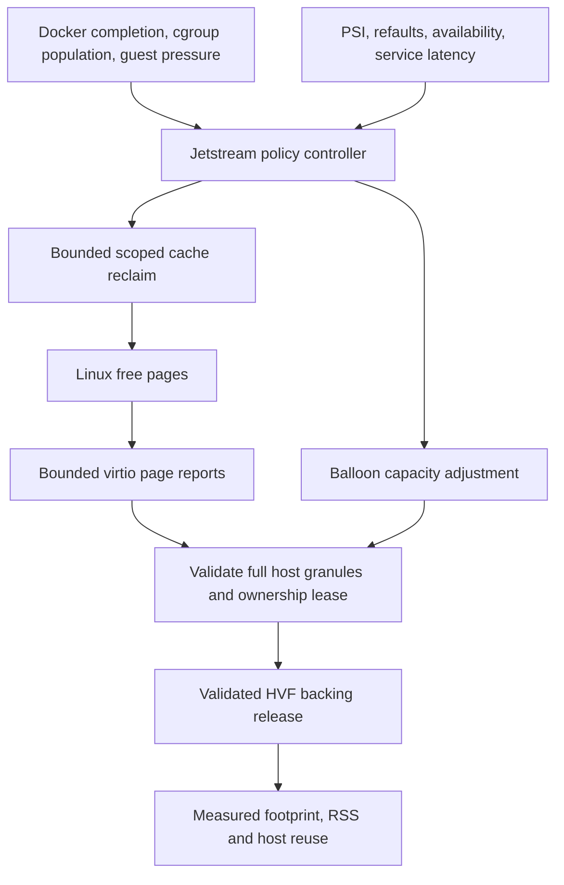

**Jetstream dynamic memory: review and implementation plan**

**Implementation work, authorized 2026-09-11**

Implement the immediate-RSS path and its correctness requirements in the order below. Do not run performance benchmarks, power comparisons, or OrbStack comparisons. The installed runtime must remain untouched; use an isolated QA home and signed test executables under `/tmp`.

- [x] Prove that an HVF-mapped allocation can be detached, zero-remapped, and mapped back without becoming resident again; verify guest read/write reuse and neighboring data. This is a correctness check, not a performance benchmark.
- [x] Implement synchronous, ownership-authorized report release with mapping restoration before acknowledgment, complete host-granule validation, failure recovery, and bounded chunks. Return owned balloon backing deterministically without waiting for unrelated workloads to stop. Retain conservative debug fallbacks.
- [x] Add a reproducible, pinned guest-kernel reporting patch and build validation for prompt bounded reporting; connect explicit reclaim completion to a reporting kick with compatibility fallback. Preserve allocator watermarks and 4 KiB guest pages.
- [x] Close generic populated-service reclaim and partial-expansion feedback gaps. Skip live/unknown scopes during generic cleanup, preserve empty-scope cleanup, and retain the pressure watchdog through partial expansion. Wire profile idle targets, dwells, and service shrink steps into Rust.
- [x] Validate Rust and guest C behavior, guest-kernel patch/configuration, and an isolated two-vCPU Linux/HVF smoke. Update runtime documentation and graphify. Record anything that remains unverified rather than claiming a subsecond guarantee.

The reactor overhaul, benchmark corrections, and comparative performance/energy targets below remain separately tracked follow-up work; none is a prerequisite for proving safe immediate physical release. Do not remove the host tick before its I/O and timer dependencies have been replaced.

**Implementation evidence, 2026-09-11**

The working tree now contains the core release implementation. Reported ranges
use HVF detach → sparse zero replacement → HVF remap before queue ACK. Complete
balloon-owned granules release per notification and restore on deflate. A
failed detach/discard falls back only after restoring a valid mapping; failed
mapping restoration terminates the VMM. The conservative route remains available
through `CONJET_MEM_DISABLE_IMMEDIATE_RELEASE=1`.

The first booted-Linux check exposed an additional cause: advancing page
reporting alone left freed pages in Linux's per-CPU allocator caches. Only about
25 MiB of RSS returned after a 64 MiB free, failing the correctness threshold.
The explicit kernel trigger now coalesces one `drain_all_pages(NULL)` before
reporting. The guest worker kicks once per completed request, including a
successful request with no cache work after process exit. Ordinary allocator
reports retain their CPU caches; this is not periodic global draining.

The final isolated two-vCPU test, using the actual patched 6.12.86 kernel and
production Jetstream device/release path, observed RSS of 140,607,488 →
70,434,816 bytes after freeing a 64 MiB guest allocation. The drop also includes
other newly eligible kernel pages, so it is not an exact attribution of every
byte. Guest zero/read/write reuse and a retained 4 MiB canary passed. The separate
HVF test covers both ownership types and repeated scattered host-granule release
with live neighbors; unit tests cover failure/rollback ordering. No benchmark, Docker build timing,
energy trial, or OrbStack comparison ran during implementation.

The initial Rust, Swift profile integration, guest C, kernel-patch, and entitled
HVF/Linux correctness checks passed after the per-CPU-cache fix. The later
chum-mem Compose E2E exercised the real PostgreSQL/API/worker/web stack alongside
three native allocation/free/reuse cycles and a Docker build fixture. Live
canaries and database persistence survived the releases and service restarts.
See [the E2E report](jetstream-memory-e2e.md) for observed RSS changes, retained
result snapshots, screenshots, and limitations.

The additional 90-second idle-capacity check timed out because the existing
64 MiB control-plane zram guard retained the larger target. RSS had already
returned; the target later converged to 512 MiB. Direct guest TCP egress also
required a QA VSOCK proxy. These observations remain explicit follow-up items;
they do not invalidate the completed ownership/reuse checks or establish a
subsecond capacity-reduction guarantee.

The user requested cleanup after testing. Temporary QA builds, kernel assets,
VM disks, proxies, containers, and raw traces are removed after the retained
result bundle is written under `docs/qa/jetstream-memory-2026-09-11`. Rebuild the
compatible VMM, kernel, and guest worker for deployment. The installed app,
daemon, VM assets, containers, and Docker socket were not changed.

Remaining release gates include ordinary guest-network-path validation,
long-running fragmented/multi-service stability, service latency and warm-cache
regression checks, supported macOS/hardware coverage, and atomic packaging of
the VMM/kernel/worker. Full policy/capability propagation, incremental ledger
accounting, event tracing, I/O reactors, bounded network queues, and power work
remain follow-up phases. This implementation does not establish the proposed
latency, battery, throughput, or OrbStack superiority targets.

**Historical audit and full follow-up plan**

The sections below preserve the 2026-09-10 audit against `bde634b4ce05275a43e6d9b18d646439ad1a21c4` on an Apple M1 Pro with 16 GiB RAM and macOS 26.6.2. Findings describe that pre-implementation revision; the implementation status above supersedes them where addressed. Earlier source inspection, reproductions, and host microbenchmarks are historical evidence, not benchmarks run for this implementation request.

Jetstream already has the essential building blocks: Rust running the VMM through Hypervisor.framework, cgroup-scoped guest reclaim, virtio ballooning, free-page reporting, host-granule ownership tracking, and service refault/pressure feedback. The main opportunity is to improve the connections between those components. Rust provides control over this implementation; performance still depends on page ownership, mapping costs, scheduling, I/O, and measurement.

The active launch path uses Jetstream/HVF. The Swift directory still named `ConjetVZ` contains orchestration and does not imply that this path uses Virtualization.framework. This plan keeps the Rust/HVF architecture.

OrbStack documents automatic return of unused memory, but its efficiency page does not provide a fixed reclamation deadline. Its published benchmark page describes older versions and cannot establish current behavior. OrbStack is unavailable on this Mac, so comparison is deferred. Superiority requires a new comparison with exact binary versions and matching workloads. [OrbStack efficiency](https://docs.orbstack.dev/efficiency), [published benchmark methodology](https://docs.orbstack.dev/benchmarks).

**What the current implementation does well**

Preserve the distinction between reclaim policy and permission to discard a page. Cgroup usage, PSI, low CPU, and a completed Docker request are signals for policy; only the guest's ownership transfer authorizes host backing changes. Preserve the 4 KiB guest / native host-granule contract, the `MUST_TELL_HOST` restore ordering, malformed-range validation, and failure recovery. The existing 16 KiB reporting-order adjustment on this host is useful and already implemented in [boot configuration](/Users/sly/Workspace/Personal/conjet/jetstream/src/vmm/boot.rs:240).

Also preserve scoped reclaim, dirty/writeback exclusions, MGLRU, service refault feedback, and the separation between stored Docker build cache and resident RAM. Cleaning RAM must not implicitly prune images, volumes, or BuildKit cache. A database's live anonymous/shared buffers are application demand, even when CPU usage is low.

**Confirmed findings and their limits**

1. **The free-page reporting route cannot guarantee an immediate physical-memory drop.** [The HVF reclaimer](/Users/sly/Workspace/Personal/conjet/jetstream/src/hvf/boot.rs:1973) uses only `MADV_FREE` for `ReportInFlight` ranges and retains the GPA mapping. This is deliberately conservative because Linux can reuse reported pages after acknowledgment without a balloon-deflate handshake. Balloon-owned ranges can instead be unmapped from HVF and advised reusable; deterministic zero remapping is reserved for a more restricted path. Advisory success is not evidence that resident pages disappeared. This is a central limitation for automatic return while services remain running.

2. **The guest reporting scheduler adds latency independently of cgroup reclaim.** The configured Linux source version is 6.12.86. Its page reporter schedules work after two seconds and budgets work per free list; the source describes roughly 30 seconds to report an idle system's pages, not a hard deadline. Adjusting `page_reporting_order` solves granularity, not this delay. A subsecond target needs a deliberately bounded reporting acceleration mechanism or another validated ownership-transfer route. [Pinned Linux source](https://raw.githubusercontent.com/gregkh/linux/v6.12.86/mm/page_reporting.c), [Linux reporting contract](https://docs.kernel.org/mm/free_page_reporting.html).

3. **Balloon release waits for complete target convergence.** [The inflate handler](/Users/sly/Workspace/Personal/conjet/jetstream/src/devices/balloon.rs:933) coalesces and reclaims owned ranges only after the target is reached. The rationale is sound: tiny zero-remaps fragment Mach VM mappings. However, already owned complete granules can remain backed while the remaining target is slow to converge. The idle controller also has an eight-second quiet dwell, reclaim settling, and delayed backing compaction. These delays must be measured separately from page reporting and host discard.

4. **Generic Docker cleanup bypasses running-service feedback.** [Docker phase/completion handling](/Users/sly/Workspace/Personal/conjet/jetstream/src/hvf/boot.rs:2870) schedules the generic reclaim endpoint. [Its guest worker](/Users/sly/Workspace/Personal/conjet/guest/image/conjet-core/src/conjet-reclaimd.c:506) includes populated service cgroups, retaining only a 128 MiB reserve and allowing up to 4 GiB per target. Sibling caps in this generic path are per sibling, rather than one aggregate budget. It does not use the service controller's PSI/refault baseline or cooldown. An isolated ordinary-file cgroup fixture selected 3968 MiB from a populated service with 4096 MiB of clean inactive cache and wrote two 64 MiB requests before the unchanged fixture counters stopped progress. This proves the request path; it does not measure Linux reclaim or database latency. Linux can reclaim more or less than the requested amount, so actual progress and feedback are necessary. [Cgroup memory interface](https://www.kernel.org/doc/html/latest/admin-guide/cgroup-v2.html#memory-interface-files).

5. **Partial expansion creates a ten-second pressure-observation gap.** [The watchdog](/Users/sly/Workspace/Personal/conjet/jetstream/src/hvf/boot.rs:718) monitors shrinking adjustments; expansion clears it, and [stabilization returns before the ordinary probe](/Users/sly/Workspace/Personal/conjet/jetstream/src/hvf/boot.rs:917). The real controller in an isolated test expanded 2048 to 3072 MiB with an 8192 MiB configured ceiling. Assuming immediate convergence, seconds 1–9 started no guest probes; the first was at +10 seconds. Guest-internal growth can therefore outrun the first expansion without another Docker lifecycle event. This is a state-machine reproduction, not a guest OOM reproduction.

6. **The running-service policy is intentionally slow.** It learns for 30 seconds, shrinks by at most 256 MiB, and waits ten seconds after convergence between adjustments. An 8192-to-2048 MiB reduction takes 24 steps: approximately 260 seconds to request the last target, excluding initial quiet time, probing, convergence, and cooldowns. This is a policy tradeoff, not proof of a leak. Returning pages already free should not require waiting for this entire capacity-reduction sequence.

7. **The selected app memory profile is disconnected from the active controller.** [Swift profiles](/Users/sly/Workspace/Personal/conjet/Sources/ConjetCore/ConjetConfig.swift:342) advertise different floors and steps, but [launch arguments](/Users/sly/Workspace/Personal/conjet/Sources/ConjetVZ/VirtualMachineController.swift:161) do not pass that policy. [Rust](/Users/sly/Workspace/Personal/conjet/jetstream/src/hvf/boot.rs:289) uses its defaults and `CONJET_MEM_CORE_*` environment overrides. For example, Swift's Performance idle target is 2048 MiB while the Rust stopped-idle default is 448 MiB. Tuning a UI profile therefore does not currently tune this controller as advertised.

8. **Status collection both costs work and overstates what the ledger knows.** [Balloon metrics](/Users/sly/Workspace/Personal/conjet/jetstream/src/devices/balloon.rs:801) and [ledger summaries](/Users/sly/Workspace/Personal/conjet/jetstream/src/devices/balloon.rs:442) scan metadata under the shared VM lock in [the status path](/Users/sly/Workspace/Personal/conjet/jetstream/src/hvf/boot.rs:4233), also used by device handling. An 8 GiB metadata fixture took 1.154 ms median for both summaries; a 32 GiB scaling fixture took 4.697 ms. These are release-mode metadata timings, without a running VM or contention. Separately, [report acknowledgment](/Users/sly/Workspace/Personal/conjet/jetstream/src/devices/balloon.rs:325) returns authority to `GuestOwned` while retaining `SoftDiscarded` backing state. Subsequent guest reuse is not observed there. Thus ledger `resident_bytes` is a bookkeeping estimate, not a physical residency measurement or proof of host memory availability.

9. **Idle operation has recurring polling at several layers.** [The launcher](/Users/sly/Workspace/Personal/conjet/Sources/ConjetVZ/VirtualMachineController.swift:182) selects a 25 ms host tick; [the tick thread](/Users/sly/Workspace/Personal/conjet/jetstream/src/hvf/boot.rs:2679) requests exits from all vCPUs each round. This schedules about 40 rounds per second, not a measured count of hardware wakeups. [VSOCK accept loops](/Users/sly/Workspace/Personal/conjet/jetstream/src/devices/vsock.rs:1819) retry every 10 ms, and [the metrics listener](/Users/sly/Workspace/Personal/conjet/jetstream/src/hvf/boot.rs:3962) every 25 ms. The one-second idle sentinel also uses a full guest telemetry request with recursive cgroup scanning. The local generated kernel configuration has `CONFIG_HZ_PERIODIC=y`, `CONFIG_HZ=250`, and no `NO_HZ_IDLE` or high-resolution timers; the source fragments do not explicitly request these. That generated configuration is not verification of the installed release kernel. The combined energy cost remains unmeasured.

10. **Host packet buffering is not bounded by guest memory policy.** [Network polling](/Users/sly/Workspace/Personal/conjet/jetstream/src/devices/net.rs:72) extends an uncapped `VecDeque`. [Receive handling](/Users/sly/Workspace/Personal/conjet/jetstream/src/devices/net.rs:200) polls before discovering that no guest receive descriptors are available. Continued traffic during a guest receive stall can grow host allocation outside the balloon ledger. Also, [vmnet reads](/Users/sly/Workspace/Personal/conjet/jetstream/src/hvf/vmnet.rs:121) allocate a fresh batch buffer and copy packets each time. Queue growth is supported by the control flow; throughput impact and growth rate have not been measured.

11. **The benchmark needs correction before supporting power or immediate-return claims.** [Active sampling](/Users/sly/Workspace/Personal/conjet/benchmarks/Sources/ConjetBench/ActivePowerSampler.swift:74) can include idle padding, but [energy calculation](/Users/sly/Workspace/Personal/conjet/benchmarks/Sources/ConjetBench/ActivePowerSampler.swift:129) multiplies whole-window mean power by only workload duration. This can bias short workloads. [Process wakeup parsing](/Users/sly/Workspace/Personal/conjet/benchmarks/Sources/ConjetBench/PowerMetricsSampler.swift:142) averages matching process rows instead of first summing a runtime's processes per sample. When several helpers match, this is not aggregate runtime wakeups. The current one-second memory samplers are also too coarse for a 250 ms target. These are static methodology findings, not measured energy regressions.

**Host experiment: accounting is not residency**

Five separate-process trials per method touched 64 MiB of anonymous host memory, executed one operation, then measured `proc_pid_rusage` RSS/physical footprint and `mincore` residency after 100 ms. This experiment used no HVF mapping, guest, Docker workload, or host pressure.

| Method | Median operation time | RSS before → after 100 ms | Physical footprint before → after 100 ms | Tested range resident after 100 ms |
|---|---:|---:|---:|---:|
| `MADV_FREE` | 571 µs | 65.27 → 65.27 MiB | 64.92 → 64.92 MiB | 64 MiB |
| `MADV_FREE_REUSABLE` | 468 µs | 65.27 → 65.27 MiB | 64.92 → 0.92 MiB | 64 MiB |
| Anonymous zero remap | 574 µs | 65.27 → 1.27 MiB | 64.92 → 0.88 MiB | 0 MiB |

The second result can represent useful host-reclaimable capacity despite unchanged RSS. The third demonstrates deterministic release for ordinary anonymous mappings; it does not prove that HVF unmap/remap preserves that benefit, remains cheap under fragmentation, or is safe concurrently with devices. Optimize useful host availability and workload performance, and report RSS separately. Do not optimize a display counter at the expense of throughput or energy.

**Proposed architecture**

Use one Rust policy owner with separate decisions for returning genuinely free pages, trimming selected cold caches, and changing the guest's available capacity:

The report-to-release edge includes a feasibility gate below. This diagram is a target design, not a claim that reported pages currently receive deterministic release.

**Implementation sequence and acceptance gates**

1. **Make evidence reliable and close the feedback gaps.** Add bounded event tracing with monotonic host timestamps, boot ID, request/ownership generation, range length, and reason. Record Docker completion, guest reclaim progress, report receipt/acknowledgment, balloon convergence, HVF detach/remap, advice calls, and externally sampled footprint/RSS. Correlate guest timestamps with an explicit clock-offset estimate; record uncertainty. Do not perform host resource syscalls for every page transition.

   Replace routine full ledger rescans with counters updated on transitions. Retain the full scan as a debug oracle and test counter equivalence. Distinguish cumulative advice, currently owned detached backing, hard-zero backing, and measured physical residency; post-report reuse makes exact ledger residency unknown. Collect an atomic snapshot without long scans under the device lock.

   Route populated-service cleanup through the same bounded feedback controller regardless of trigger. Apply one budget across siblings; cancel remaining work on a new workload generation or urgent pressure. Preserve fast cleanup of confirmed empty build/service scopes. Observe pressure throughout reduced capacity, including expansion convergence and stabilization; stabilization delays only further shrinking. Gate on state-transition tests, stale/missing telemetry, cgroup replacement, multiple siblings, cancellation, and a service running alongside a build.

   Correct energy sampling to integrate timestamped samples over the actual measured interval. Batch genuinely repeated short work to obtain adequate coverage; do not substitute idle padding for active samples. Sum helper wakeups per sample before averaging across time. Label package power, process estimates, baseline-adjusted energy, and unitless Energy Impact separately.

2. **Prove the HVF page-release mechanism before tuning for subsecond return.** Build an isolated, signed HVF test harness using the same memory and device code as Jetstream. Compare current soft advice, detached reusable balloon pages, detached hard-zero balloon pages, and a research path that unmaps, replaces backing, and remaps a reported range entirely before its acknowledgment. Linux isolates reported pages until the report completes, but Jetstream currently forbids detachment on this route; changing that invariant needs a complete ownership and device-access proof, not a timer adjustment. [Linux ownership interval](https://docs.kernel.org/mm/free_page_reporting.html).

   The decisive question is whether `hv_vm_map` eagerly restores physical residency or wiring and erases the host-only experiment's gain. Measure that directly. Verify that all four 4 KiB subpages of a 16 KiB host granule belong to the same valid operation, no outstanding host/device references can touch the range, and the mapping is usable before acknowledgment. Add real pin/exclusion tracking before moving reclamation to an asynchronous worker; the existing ledger's unused `Pinned` variant is not such a mechanism.

   Use bounded coalesced batches and track mapping count, operation latency, report acknowledgment latency, and vCPU/device stalls. For balloon-owned ranges, prototype processing complete owned extents before total target convergence, with generation checks and serialization against deflate. Avoid reverting to one tiny remap per descriptor. Inject unmap, advice, remap, timeout, and reset failures; never acknowledge unavailable memory or continue after an unrecoverable mapping failure.

   Gate on correct allocation/reallocation canaries, randomized fragmented ranges, concurrent device activity, stable mapping counts, and measurable host availability. If temporary report remapping is ineffective or too expensive, retain its advisory route and improve the explicit balloon-owned route. A new guest reuse protocol is a later research option, not an assumed requirement or a promised solution.

3. **Accelerate reporting around real reclamation events.** Once a useful host release mechanism passes, add a narrow, versioned guest-kernel mechanism to request a bounded immediate reporting pass after an empty build scope or measured large free-page burst. Control both scheduling delay and work budget. Keep stock-style coalescing outside that short window. This requires a maintained patch against the pinned guest kernel; the existing reporting-order sysfs control does not change the two-second delay. Preserve watermarks, allocator fairness, guest page size, and ordinary reporting fallback.

   Separate Docker transport completion from actual build-worker/cgroup quiescence. A closed API stream is an early hint; it does not prove that background work stopped. Cancel or reduce boost on workload restart, scarce `MemAvailable`, or pressure. Gate on time from real workload completion to page reports, reporting CPU time, allocator latency, fragmentation, and repeated-build performance. Do not continually scan PFNs or put synchronous host work on every guest free.

4. **Make running-container cleanup adaptive and urgent expansion event-driven.** Reuse the guest event transport but add a priority message for service population, availability, and pressure. The current stream collects full telemetry, watches root memory events, uses a global PSI trigger, and enforces a one-second minimum interval. Merely connecting it to Rust will not deliver a subsecond emergency path. Use service-specific `cgroup.events` and PSI watches, bounded messages, monotonic generations, reconnect handling, and a low-frequency health fallback.

   PSI `avg10` is too smoothed for burst response; use trigger notifications and counter deltas with availability/headroom. Kernel PSI has a minimum 500 ms window and rate-limited notifications, so event-receipt-to-action latency must be reported separately from pressure-onset-to-detection latency. Preserve proactive capacity restoration on host Docker starts. No monitor guarantees that an arbitrarily large sudden allocation is served without stalls. [PSI documentation](https://docs.kernel.org/accounting/psi.html).

   For live services, maintain a workload-generation working-set estimate, burst reserve, and learned refault headroom. Start cold-cache reclaim conservatively and increase its budget only after clean feedback; reduce it sharply and restore capacity on refault, major-fault, PSI, swap, or application-latency regression. Use the kernel's recency model; inactive cache is a candidate, not proof of future disuse. Freed application pages can return promptly without forcing the whole guest to its minimum target. Gate on databases, repeated warm builds, burst allocations without host Docker events, and overlapping builds/services.

5. **Remove idle polling and bound host allocations.** Introduce a persistent readiness-driven reactor for Unix sockets and VSOCK, using the project's existing facilities or native `kqueue`/dispatch. Add vmnet receive notifications, queue-credit wakeups, targeted vCPU kicks, and nearest-deadline timer handling. Verify networking, virtio timers, interrupt delivery, WFI, shutdown, and reconnection before disabling the 25 ms all-vCPU tick. Replace accept/sentinel polling with readiness and population events; keep a slow bounded recovery check.

   Enable and validate `CONFIG_NO_HZ_IDLE` and appropriate high-resolution timers in explicit kernel fragments; verify the final image configuration, timer accuracy, scheduling, boot, and supported hardware. This does not require defaulting to `NO_HZ_FULL`.

   Bound host packet queues by bytes and packets. Suspend reads when guest credits are exhausted where practical; otherwise use an explicit bounded drop policy and counters. Reuse batch buffers and avoid packet copies where lifetime ownership permits. Apply equivalent queue/backpressure review to control and VSOCK paths. Gate on sustained ingress while the guest is stalled, recovery without unbounded buffering, idle wakeups, network p99, and energy-to-solution.

6. **Unify policy, then run comparison and rollout gates.** Pass a versioned effective policy from Swift configuration to the Rust controller with an explicit precedence rule for debug overrides. Return the actual applied policy and kernel/VMM capabilities to CLI/app status. Keep one controller. Profiles should select validated tradeoffs in reserve, cold-cache aggressiveness, and power scheduling while retaining identical ownership safety rules.

   Keep changes in separately reviewable commits: telemetry/benchmark correctness; feedback fixes; host backing feasibility; kernel reporting; running-service events; reactors/queues; policy integration. Avoid a large unrelated Rust refactor before these behaviors are measurable. Gate experimental backing and kernel behavior behind capabilities with the existing conservative route available. Package the compatible VMM/kernel pair atomically and test old configuration migration. Validate affected CLI/app surfaces with screenshots in an isolated QA home before release.

**Proposed performance targets, not achieved results**

Define `t0` as verified workload completion or an explicitly timestamped large free-page event. For a controlled workload, preregister a releasable budget of at least 512 MiB and retain a documented safety reserve. Report both guest-side eligibility and host-visible results. For real builds with an unknown reusable amount, report fixed-time deltas and a full curve rather than inventing a T90 denominator.

| Measure | Initial engineering gate |
|---|---|
| Accepted completion event → scoped reclaim request | p95 ≤ 50 ms |
| First sustained host memory drop | p95 ≤ 250 ms; drop exceeds max(32 MiB, 5% of known budget) and persists at least 500 ms |
| Return of 90% of the known safe budget | T90 p95 ≤ 1 s; threshold remains satisfied for 2 s; footprint and RSS reported separately |
| Urgent event received → expansion target submitted | p95 ≤ 100 ms; detection and balloon convergence measured separately |
| Service impact of cleanup | p95/p99 request latency regression ≤ 5% against the same Conjet workload with aggressive reclaim disabled; no new OOM, corruption, or sustained swap |
| Repeated build/development loop | wall time and joules regression ≤ 3% against the current Conjet baseline |
| Controller-generated periodic work at quiescence | target ≤ 1 scheduled wakeup/s in aggregate; measure actual runtime/helper wakeups and guest timer work separately |
| Long-cycle stability | no growing host queues or mappings and no significant retained-footprint slope after repeated warmup/settle cycles |

These budgets may require revision after the HVF feasibility experiment, especially under fragmented reports or small free-page bursts. A large live working set is not subject to an arbitrary minimum-memory target.

**How to demonstrate an advantage over OrbStack**

Use the existing standalone benchmark package and topology labels. Add a dynamic-memory suite and a persistent native sampler instead of a repeated shell/HTTP pipeline. Sample host resource counters at approximately 20–50 ms only during short memory-return windows, use inexpensive event/counter snapshots, and measure the sampler's overhead. Use coarser sampling for long power runs. Record all runtime/helper PIDs, executable hashes, kernel/configuration hashes, memory/CPU caps, OS, hardware, power source, thermal state, topology, architecture, and image digests.

Run paired comparisons serially with randomized order on the same host; the normal wrapper's parallel wall-time suites are unsuitable for this comparison. Use a common guest-volume baseline first, then compare `strict-bind`, `smart-bind`, and `conjetfs` as distinct product configurations. Keep ARM64 native and x86 emulated results separate. Separate cold, no-cache, and warm cache trials and include the next warm build so aggressive cleanup cannot hide a cache penalty.

| Workload | What it establishes |
|---|---|
| Known-size allocate/touch/free, then reallocate and verify | Physical return, reuse latency, and data correctness |
| ARM64 Rust/JS/C++ builds, cold and repeated warm | Build completion return and real development-loop cost |
| PostgreSQL and Redis under request load, plus unrelated builds | Whether automatic cleaning preserves live working sets and tail latency |
| Guest-internal allocation bursts after partial expansion | Detection, further expansion, and reserve behavior without host lifecycle hints |
| Guest receive stall with sustained network traffic | Bounded host memory outside guest RAM and recovery |
| Fragmented free ranges and repeated build/start/stop cycles | Granule coverage, mapping overhead, retention slope, and oscillation |
| Quiescent VM and idle running services, at least ten-minute windows | Runtime/helper wakeups, CPU, baseline-adjusted host power |
| Controlled host consumer reusing released capacity | Useful host availability, beyond accounting or Activity Monitor changes |

Use approximately 10 trials to detect early regressions and at least 30 paired trials for a published workload comparison, with enough actual service requests to estimate p99 reliably. Run 100 cycles for initial stability and a longer soak before release. Preserve failures, raw timestamped results, confidence intervals, and all cache/topology labels. Where host pressure is needed, use an isolated bounded test setup and abort before disrupting unrelated work.

Predeclare a comparison target: at least 20% lower T90 and 20% lower integrated excess-footprint time over the first 30 seconds for applicable memory-release workloads; at least 10% lower active joules and build/development wall time on selected workloads; and lower idle power above the measurement noise floor. Use paired confidence intervals to establish differences and report unsuccessful rows. These are ambitions, not forecasts. An improvement on one axis does not justify a blanket claim that Conjet beats OrbStack on every workload.

**Evidence and scope of this review**

The earlier isolated audit at the same commit contains the real controller reproduction, guest C fixture, and metadata timings in [its report](/Volumes/ExternalSSD/dev_workspace/tmp/conjet-memory-audit.c9EIv2/dynamic-memory-review.md). Host syscall experiment source is [host-reclaim-probe.c](/Volumes/ExternalSSD/dev_workspace/tmp/conjet-memory-plan.j7v7SX/host-reclaim-probe.c), with [raw observations](/Volumes/ExternalSSD/dev_workspace/tmp/conjet-memory-plan.j7v7SX/logs/host-reclaim-probe.jsonl). These are local QA artifacts and should be archived alongside future benchmark results if retained long term.

No focused regression-test failures remain from that audit. An initial scratch linker error was resolved by copying the omitted repository `jetstream/build.rs` into the harness; it was a harness setup issue. The host experiment completed without assertion failures. No live HVF reclamation, guest-kernel behavior, application latency, or energy comparison was measured. No Conjet/OrbStack runtime was started or stopped, no runtime configuration changed, and no source implementation changed. This document has no affected application surface requiring screenshot QA.
