# Production readiness work — September 13, 2026

**Status: incomplete; do not describe this working tree as production-ready.**
The confirmed monitoring, SSH boot, action-safety, readiness and entropy-device
issues below are fixed. Ordinary macOS bind mounts still fail. Ad-hoc signing is
explicitly authorized for the requested major release; the persistent privileged
service remains disabled in that mode, with the existing sudo helper as fallback.
No commit, push, installation or release was performed in this pass because the
requested functional readiness is incomplete.
The dynamic-memory implementation was not changed.

**Subsequent release decision:** after receiving this report, the user explicitly
requested committing, pushing and publishing the current implementation with
ad-hoc signing. Conjet 3.0.0 and Core 1.3.1 were published under that updated
authorization; see the [release verification](releases/conjet-3.0.0-verification.md).
The failures below remain disclosed in the release notes; the earlier QA evidence
is retained as a historical record.

## Implemented

- Process monitoring covers every running container with at most four concurrent
  `docker top` commands. Results preserve inventory order. Individual failures
  produce a visible coverage warning; cancellation stops scheduling more work.
  App navigation/profile changes cancel the active snapshot and discard its result.
- The appliance target starts `systemd-user-sessions.service`. CLI SSH connections
  use their own explicit configuration and no longer install a global SSH Include.
  Explicit `ssh config install` remains an opt-in command. No user's SSH config was
  edited during QA.
- Docker's existing event connection advances a control-ready VM to Docker-ready.
  No additional permanent readiness polling was introduced.
- The host readiness probe waits for a complete HTTP response. A fragmented
  `HTTP/1.1 200 OK` status line previously looked like the final `OK` body and
  prematurely ended a read. Version/info checks now require parsed JSON objects
  and complete declared bodies; malformed lengths and incomplete chunks fail
  without integer overflow. This is a bounded Docker probe, not a general HTTP
  implementation.
- Jetstream's advertised virtio RNG device now supplies operating-system entropy
  with bounded request sizes and queue processing. Reset clears queue indices.
  The RNG no longer advertises EVENT_IDX, which its queue executor does not
  implement; doing so suppressed later guest notifications. No guest RAM mapping
  or dynamic-memory policy was changed. Short entropy completions follow the
  [Virtio entropy-device specification, section 5.4](https://docs.oasis-open.org/virtio/virtio/v1.3/virtio-v1.3.pdf).
- Compose starts with no project selected, offers a directory picker and identifies
  the discovered Compose file. Actions are disabled for missing projects and run
  `compose config --quiet` first. Validation failures remain readable.
- Compose and Dockerfile-editor argument fields preserve quoted values, empty
  arguments and escaped spaces without shell expansion. Malformed quotes/escapes
  fail before commands or image builds start. Quoting rules follow the
  [GNU Bash documentation](https://www.gnu.org/s/bash/manual/html_node/Double-Quotes.html),
  with variables, substitutions and shell operators passed literally.
- Volume cleanup previews unused volumes, selects none automatically, and deletes
  only the reviewed selection after confirmation. Individual removal also has a
  confirmation. Docker still rejects in-use volumes; errors remain visible.
  The CLI's existing prune semantics are unchanged.
- Container Info shows actual Mac listener state and errors independently of the
  Docker port mapping. Exposed-only ports are distinguished from published ports.
  Port numbers are displayed without locale thousands separators.
- Terminal preparation is recorded as **prepared**, with a neutral status and
  terminal icon. It does not assert successful shell execution. Full commands have
  a selectable, scrollable block; the sidebar fits Activity Monitor.
- App staging accepts external Swift/Rust artifact directories and bundles the
  new service's LaunchDaemon plist with explicit helper/daemon signing identifiers.
- The app release workflow also runs Jetstream tests and host-networking race
  checks. Missing signing/notarization secrets retain the existing ad-hoc fallback.

## Privileged port service

The packaged app registers `dev.conjet.port-helper` with `SMAppService`. The helper
exposes one XPC operation: bind a literal IPv4/IPv6 address on TCP/UDP ports 1–1023
and return an owned descriptor. It cannot execute commands or accept filesystem
paths. The helper remains root only to create the socket; normal Conjet forwarding
owns the transferred socket thereafter.

Both endpoints enforce code requirements: Apple trust anchor, matching signing
team, explicit helper/daemon identifier, and no debug entitlement. The helper's
listener rejects untrusted clients before exposing the interface. Requests are
validated again in the helper; the client has a bounded reply timeout and keeps
POSIX bind errors for conflict diagnostics. A source/ad-hoc build keeps the existing
cached-sudo fallback; it cannot register this persistent service. The menu bar
helper directs authorization to its enclosing main app to keep one service owner.

The Network page explains unavailable signing, pending approval and repair.
[Apple's service registration contract](https://developer.apple.com/documentation/servicemanagement/smappservice/register%28%29)
requires administrator approval for a LaunchDaemon. Peer checking follows the
[NSXPC connection requirement API](https://developer.apple.com/documentation/foundation/nsxpcconnection/setcodesigningrequirement%28_%3A%29).
The current Mac reports **zero valid code-signing identities**. No service was
registered and no administrator prompt or installation was attempted.

## Local validation and practical limits

QA used a separate app, daemon, guest disks, Docker configuration, named test
resources and home under the external scratch volume. The installed app/runtime
was not stopped or replaced. Test artifacts were kept outside the repository;
accepted screenshots and concise logs are retained in
[the evidence folder](qa/production-readiness-2026-09-13/).

- The full Swift suite and focused checks covered the code changes. XPC protocol
  serialization transferred a usable descriptor through an anonymous connection;
  negative code-signature tests rejected the ad-hoc runner. This does **not** prove
  system LaunchDaemon installation or authorized low-port binding.
- The complete Core rootfs was rebuilt from a scratch source copy as `1.3.0-qa`
  using the normal Docker image builder. Its SHA-512 was verified before expansion
  into a fresh isolated root disk with a fresh data disk. The packaged daemon/VMM
  booted that image without guest patches or executable overrides. Public CLI SSH
  returned `packaged-core-ssh-ok`; user-sessions was active and `/run/nologin` absent.
  A Core release is still required to distribute this rootfs change. The compatible
  cached custom kernel was reused; these fixes do not require a kernel source change.
- The final packaged VM completed a 4 KiB `/dev/hwrng` read within the check's
  five-second timeout, then completed another after guest driver unbind/rebind.
  The earlier device implementation timed out despite appearing in `rng_available`.
  Fresh-image Docker readiness and the Machines screen now agree. This is
  correctness evidence, not a controlled boot-speed or power benchmark.
- The final ad-hoc app passed deep signature verification. The resulting DMG passed
  integrity and SHA-256 verification. The first mount attempt at an external-volume
  mount point returned permission denied; mounting read-only at macOS's default
  location succeeded. App/CLI/VMM/network signatures and the bundled LaunchDaemon
  plist were verified from the mounted image, which was then detached.
  The local simulation retained version `2.1.2`; no new release version was assigned.
- The user's full-tunnel route remained `utun6`. Image downloads, container HTTPS,
  bridge DNS and named-volume persistence were exercised. Host HTTP port 18888
  answered; 80/443 correctly remained authorization failures.
- The app displayed all sixteen monitoring fixtures. The actual chum-mem Compose
  configuration was validated in the UI. Its Postgres settings/migrations were run
  with an isolated image-copy override: 37 tables initialized and a test row
  survived restart. This override does **not** validate live host binds, nor the
  full API/worker/web stack.
- Native UI evidence covers project selection, process coverage, port authorization,
  volume preview/confirmation, host-port diagnostics and terminal input/output.
  Destructive UI confirmation was cancelled; scoped deletion behavior and in-use
  rejection are covered by automated tests. No full VoiceOver certification,
  performance benchmark, sleep/wake campaign or exhaustive Docker API matrix was run.

## Failures retained

1. The new opt-in compatibility check still fails the host bind case with Docker's
   **“bind source path does not exist”** for a real Mac directory. Its preceding
   named-volume, bridge-DNS and HTTPS checks completed; test-owned resources were
   removed. It is a deliberate unresolved product failure, not a skipped check.
2. TCP 80/443 remain **requires_privileged_helper** because no privileged helper
   was authorized in QA. Direct unprivileged TCP and UDP binds on this Mac returned
   `EACCES`. Ad-hoc signing is allowed, but does not confer permission to bind these
   ports. Successful sudo-helper E2E remains unvalidated; persistent-service
   authorization, revocation and upgrades additionally need a team-signed build.
3. Initial helper implementation checks found a Security API static-code type
   mismatch and invalid requirement syntax (`not`/boolean equality). These were
   corrected using the compiled Apple requirement language; focused/full checks
   no longer report those failures.
4. The initial Alpine HTTP fixture exited without serving; QA switched to the
   explicit Python HTTP server image. This was a fixture issue, not evidence that
   Conjet's publisher failed.
5. The fragmented-status-line regression test failed against the previous readiness
   reader, then passed after the framing correction. The prior test fixtures also
   contained an incorrect Content-Length and an incomplete final chunk terminator;
   both fixtures were corrected.
6. Initial live hardware-RNG reads timed out with both the old no-op device and
   the first backend implementation. Removing the unsupported EVENT_IDX feature
   fixed repeated reads; the final reset/read check completed. These resolved
   failures are retained separately from the unresolved filesystem failure.

## Remaining implementation and release gates

### Real host filesystem sharing

The active Rust bridge still cannot expose ordinary Mac paths to Linux Docker.
The existing Swift snapshot-volume coordinator and ConjetFS synchronization are
not equivalent to live bind semantics and were not enabled as a substitute.

Evaluation covered libkrun's maintained macOS virtio-fs implementation. Its
[documented filesystem isolation limitation](https://github.com/libkrun/libkrun#security)
means embedding its backend alone would not establish approved-root confinement.
A scratch probe compiled the public `krun-devices` 1.19.3 filesystem device on
this Mac, without changing repository dependencies. Its public device wrapper
does not expose all caching controls needed for live host changes. Compilation
does not validate confinement, cache coherence or lifecycle integration. No new
filesystem dependency or partially working device was added to the product.

The next implementation must add a Jetstream filesystem transport with bounded
worker queues, device reset/shutdown handling, approved-root confinement and
Linux/macOS permission translation. Avoid DAX mappings that could interfere with
working memory release. Mount shares before Docker readiness. Then validate file
and directory mounts, both write directions, read-only behavior, symlink escape
and rename races, atomic saves/deletes, notifications, spaces in paths, removable
volumes and denied roots. Only then run the unmodified chum-mem service stack.

The repeatable initial gate is:

```sh
python3 build-support/test-runtime-compatibility.py \
  --docker-socket "$QA_HOME/run/docker.sock" \
  --qa-root "$QA_ROOT"
```

It requires an explicitly selected disposable runtime and cleans only its own
containers/networks/volumes and scratch files. It returns nonzero on the current
bind failure. It is an initial correctness check, not a full filesystem test matrix.

### Distribution and broader compatibility

The rebuilt Core rootfs and ad-hoc package were validated locally. The user has
authorized ad-hoc signing for the major release, so Developer ID credentials are
not a release gate for this request. Complete real filesystem sharing and validate
the sudo-authorized low-port path before publishing. The new persistent service
has separate team-signing and administrator-approval requirements. Existing
network limits from the [runtime review](runtime-feature-review.md) remain:
external IPv6/raw ICMP, automatic HTTP proxy discovery, VPN reconnect/split-DNS,
sleep/wake and broader plugin/Swarm/emulation compatibility are not established.
There is no evidence here for a universal compatibility or performance claim.

## Screenshot walkthrough

1. Missing Compose project disables actions.

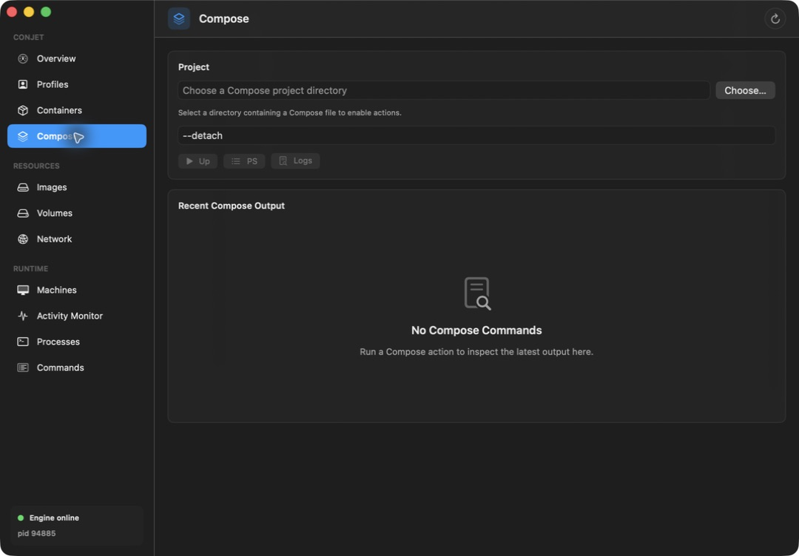

2. chum-mem's real Compose file is identified and its status action validates first.

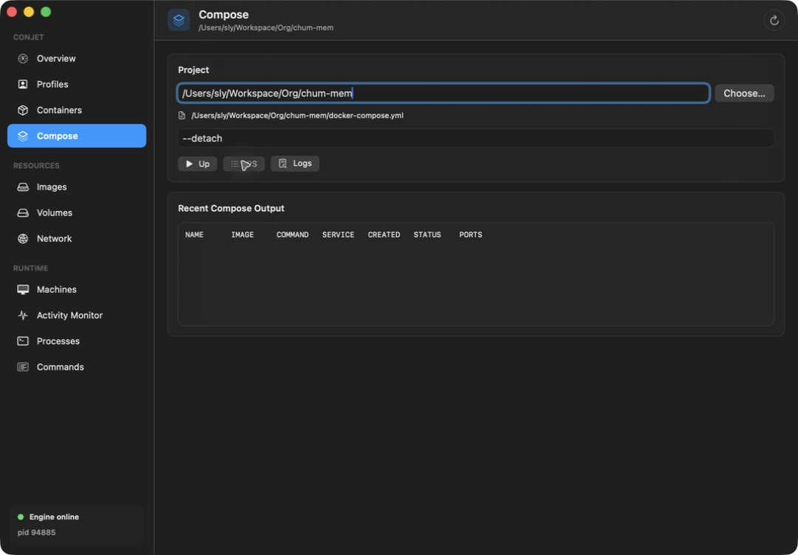

3. All sixteen running process fixtures appear, including those previously omitted.

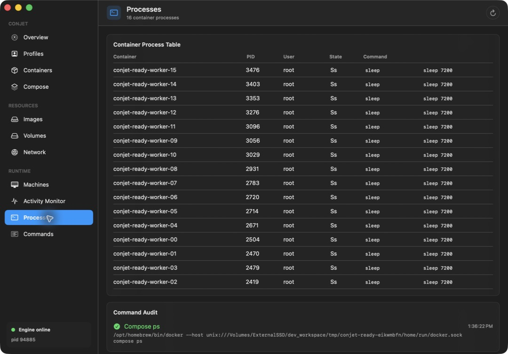

4. Persistent port authorization is visibly unavailable for the ad-hoc build.

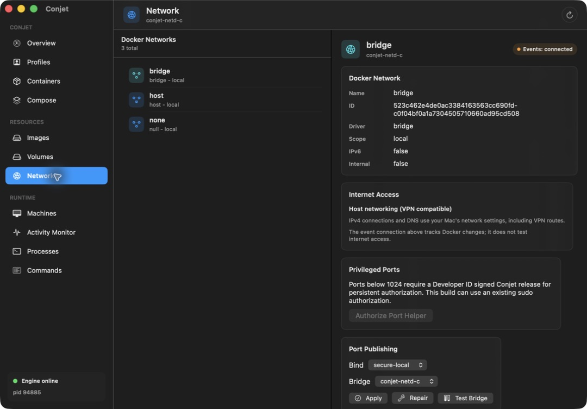

5. Volume preview excludes the in-use Postgres volume and selects nothing.

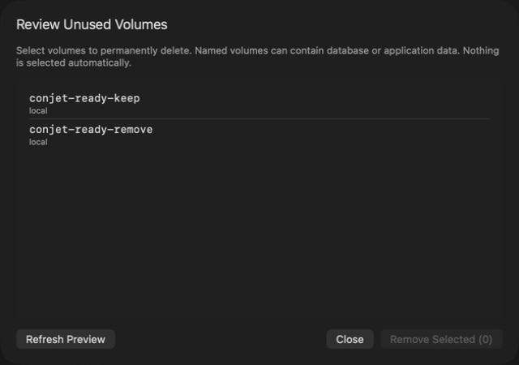

6. Confirmation identifies the exact selected volume. This action was cancelled.

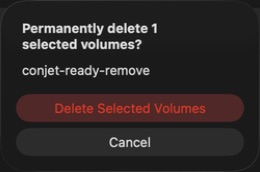

7. Container Info distinguishes blocked 80/443 listeners from the working high port.

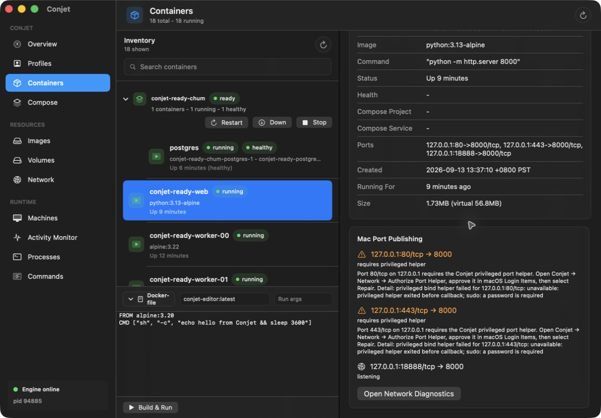

8. Embedded terminal input produces the expected output. Terminal contents are not
exposed by the captured accessibility tree, so assistive-technology support remains
an explicit limitation.

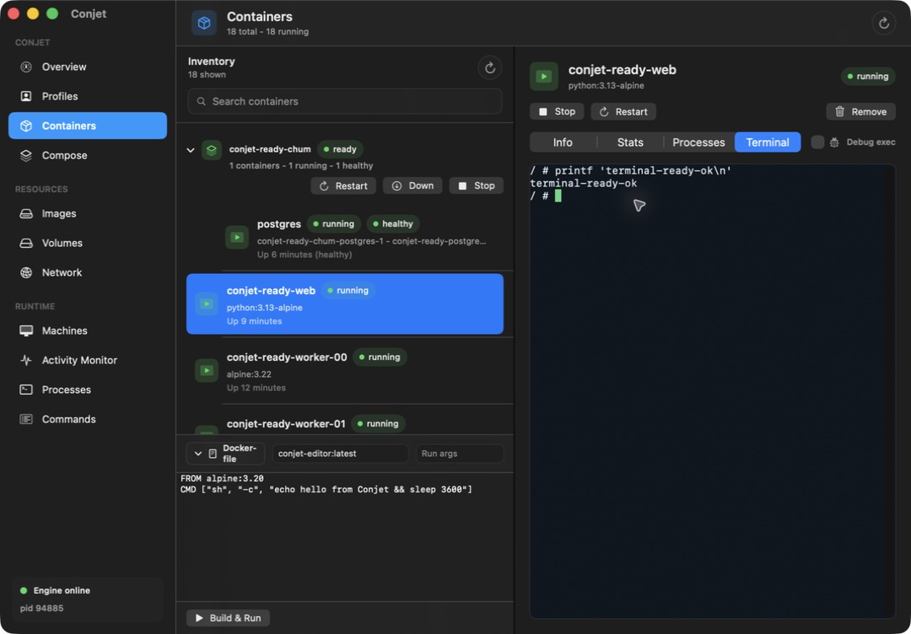

9. Terminal preparation is labelled separately from completed commands.

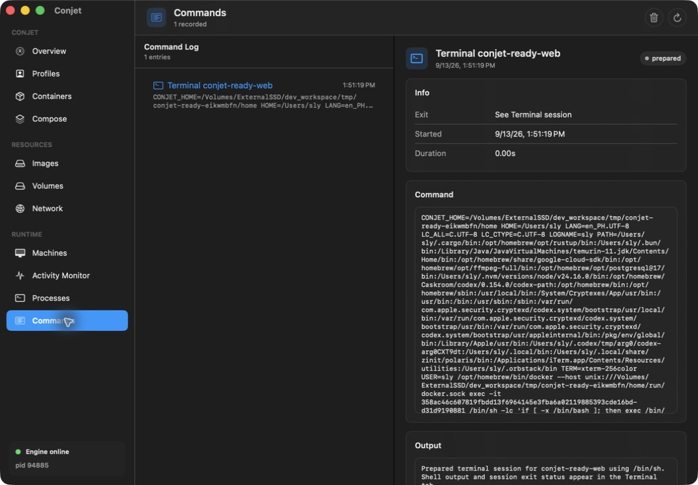

10. Malformed quoted arguments are rejected before Compose starts. A corrected
quoted scale argument subsequently started the disposable service from the UI.

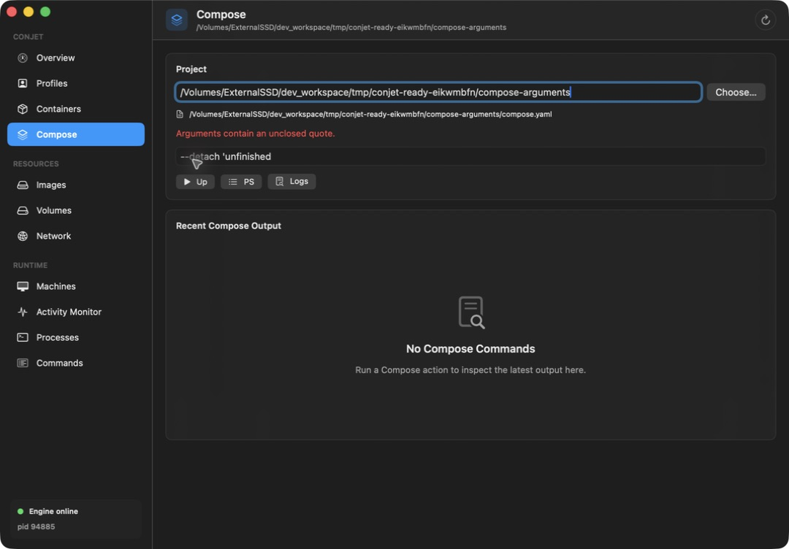

11. The final packaged daemon/VMM reports Docker-ready with the rebuilt Core image.

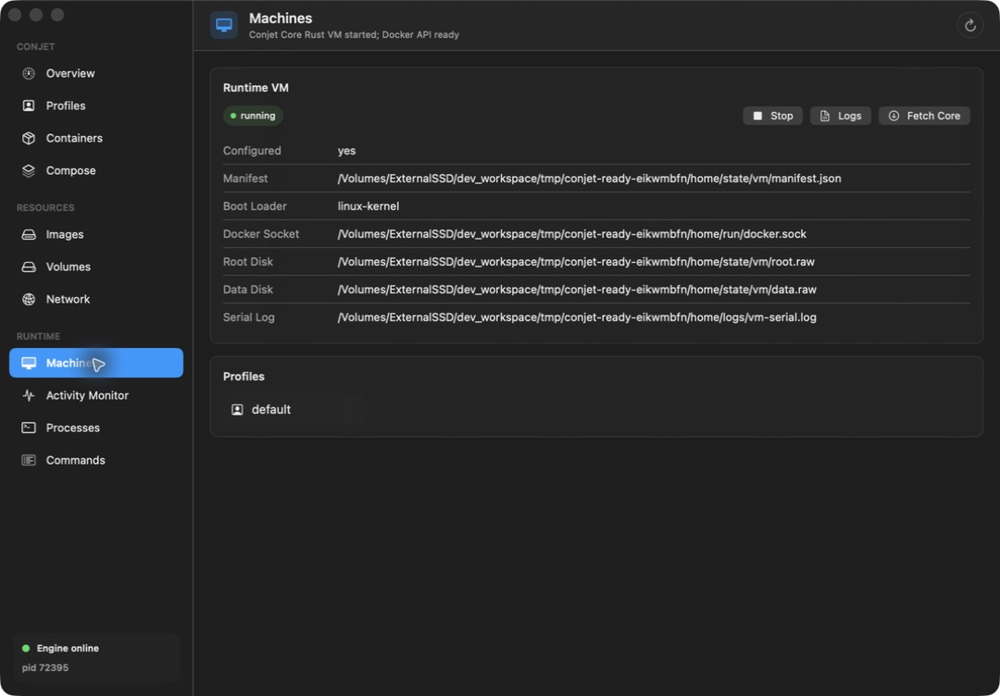
