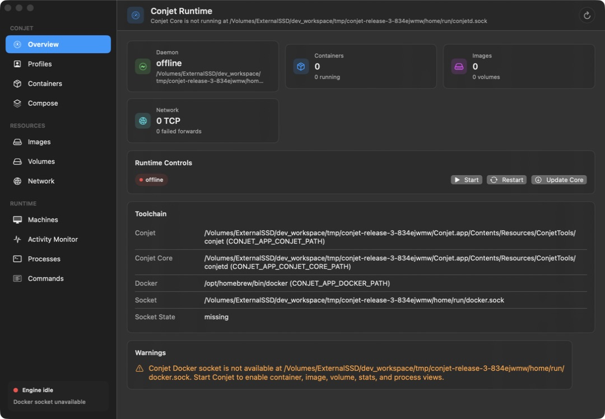

# Conjet 3.0.0 and Core 1.3.1 release verification

Verified September 13, 2026. The user explicitly requested publication after the
known limitations were reported and selected ad-hoc signing.

## Published state

- [Conjet 3.0.0](https://github.com/omega13-engr/conjet/releases/tag/conjet-v3.0.0)
  is the latest app release, with the arm64 DMG, SHA-256 file, formula and cask.
- [Core 1.3.1](https://github.com/omega13-engr/conjet/releases/tag/conjet-core-v1.3.1)
  contains the Linux 6.12.86 kernel, Docker rootfs, manifests and SHA-512 files.
- Both annotated tags resolve to source commit
  `f1df93258a21ff4dac33475e9cf4e9ef7dca7297`.
- [Homebrew PR #31](https://github.com/omega13-engr/conjet/pull/31) was merged as
  `5ae97c0abf327324107763368c174eeef9b1b08a`. Its only changes are the formula/cask
  version, URL and checksum. Main-branch package files match the published assets.

The [app release workflow](https://github.com/omega13-engr/conjet/actions/runs/34756171208),
[Core release workflow](https://github.com/omega13-engr/conjet/actions/runs/34756170934)
and [source CI run](https://github.com/omega13-engr/conjet/actions/runs/34756153425)
completed successfully. The app workflow used the requested ad-hoc signing path.
The published release notes include the implementation changes and known limits.

## Download and package verification

All three binary downloads matched their published checksum files and GitHub
asset digests. The Core kernel also matched its manifest's SHA-256, and the rootfs
manifest reports version `1.3.1` with the appliance systemd target.

The DMG SHA-256 is:

```text
abd9d29724920f957a13ac5277b2458637ee6ad89b66e45004b30c96b29b1eb6
```

The downloaded DMG was mounted read-only. Deep signature verification covered
the app and packaged executables, including the networking and privileged-port
helpers. The app reports version `3.0.0`, signature `adhoc`, and no signing team.
The LaunchDaemon plist is bundled. The app targets macOS 14.0; the networking
helper's minimum deployment target is 12.0, within the app's supported range.

The published CLI and VMM help commands and networking-helper version command
ran locally. The published app was copied into an external scratch directory and
launched with an isolated `CONJET_HOME`, explicit bundled tool paths, and background
registration disabled. Its UI rendered correctly and reported the intentionally
absent QA runtime. No VM was started for this publication check. The earlier
complete-rootfs boot, SSH and RNG evidence is in the
[readiness report](../production-readiness.md); this publication check did not
repeat that guest workload campaign against the downloaded Core binaries.



Downloaded binaries, staged app and scratch files were removed after verification.
The QA app was terminated and the DMG detached. The installed Conjet runtime,
containers, Docker socket and global SSH configuration were not modified.
Concise machine-readable evidence is retained in
[the release QA directory](../qa/release-3.0.0-2026-09-13/).

## Unresolved compatibility checks

- Live Mac bind mounts still fail with `bind source path does not exist`.
- Administrator-authorized port 80/443 forwarding remains unvalidated;
  unprivileged binds return `EACCES`. The persistent helper is disabled for ad-hoc
  builds, while the existing sudo helper remains available.

Publication does not establish completion of the broader production-readiness
objective. These limitations are disclosed in both the review and release notes.
