# Runtime feature review and connected-VPN validation

Reviewed September 11–13, 2026. Implementation and final QA used the September 13
working tree based on Conjet 2.1.2. This is a local implementation and review,
not a published release. Dynamic-memory behavior was excluded and left unchanged.

## Outcome

The new host networking backend worked after the user connected a full-tunnel
VPN **without restarting the already-running QA VM**. macOS routed the public
test destination through `utun6`. Host and container HTTPS requests returned the
same public exit address. That address was compared in memory and not retained.
The VPN application's name was not supplied. These observations establish
compatibility with the connected configuration, not every VPN product or policy.

Fresh registry downloads, guest DNS, HTTPS, a BuildKit build that downloaded
packages, concurrent checksum-verified TCP responses from the Mac, UDP replies,
and existing TCP/UDP published-port paths worked. The same backend also booted
from the staged application using its adjacent bundled helper with no executable
or egress environment overrides. Current Core 1.3.0 assets were sufficient.

The wider review **does not establish full Docker compatibility**. Ordinary
macOS bind mounts and guest SSH startup have confirmed gaps. Privileged port
authorization and monitoring completeness also need further work below.

## Changes implemented

- Default `network.egress_mode = "host"`; explicit `vmnet` remains available.
  Older profile files decode to the host default. The selected mode survives
  profile edits and appears in the running network status.
- A small unprivileged Go helper embeds pinned gvisor-tap-vsock v0.8.9. Rust
  Jetstream still owns HVF execution, virtio devices, and memory. The helper
  exposes only an inherited socketpair, with no upstream HTTP control API.
- CGO/native macOS address resolution and ordinary host sockets follow host
  routing and DNS changes. No routes, PF rules, VPN settings, or public DNS
  fallbacks are added. There is no silent fallback to vmnet on helper failure.
- Rust packet queues are bounded. Fragmented frames and partial writes survive
  backpressure. TX descriptors are acknowledged only when accepted; short vmnet
  writes previously acknowledged unsent packets. Outstanding TX is retried by
  the existing host poll path. Helper startup has a timeout and the owned child
  is reaped when the VMM releases it.
- Network UI distinguishes Docker events from internet access, displays the
  active egress mode, and provides readable port policy controls. Profiles exposes
  Internet Access with a next-start explanation.
- `requires_privileged_helper` now counts as a failed forward. The previous
  counter showed zero even when neither port 80 nor 443 could bind. The final
  app visibly reports two failed forwards for that reproduced condition.
- App/login-item/DMG packaging includes and signs the helper. Source-build
  workflows and Homebrew HEAD dependencies include Go and Rust.

## Confirmed issues and implementation priorities

### P1: normal macOS bind mounts are unavailable in the Rust socket path

The isolated reproduction created a real host directory and file, then requested
`docker run --mount type=bind,src=HOST,dst=/data,readonly ... cat /data/proof`.
Docker returned exit 125: **bind source path does not exist**. The directory was
on the Mac, but the Linux daemon could not access it.

The active Rust Docker bridge in `jetstream/src/devices/vsock.rs` forwards API
traffic and rewrites the existing service cgroup parent. The Swift
`DockerManagedHostMountCoordinator` is not attached to that Rust socket path.
The profile's Host Mounts toggle therefore cannot establish ordinary live Docker
bind semantics by itself. ConjetFS project copying into named volumes is a
different workflow; it does not prove bidirectional bind mounts or inotify.

Implement a host file-sharing transport/device for Jetstream and mount the
approved shares before Docker readiness. Preserve file and directory mounts,
read-only permissions, symlinks, rename/delete semantics, and host/container
change visibility. Gate it with raw Docker and Compose bind tests, including
paths containing spaces and denied host paths. Do not present snapshot volume
copying as fully compatible live filesystem sharing.

### P1: appliance SSH remains behind the boot login gate

SSH key provisioning and sshd startup succeeded, but an actual OpenSSH session
failed with exit 255 and **“System is booting up. Unprivileged users are not
permitted to log in yet.”** `/run/nologin` remained present and
`systemd-user-sessions.service` was inactive. The custom appliance target requires
`basic.target` and does not start the normal user-session service.

Starting `systemd-user-sessions.service` **only inside the disposable QA guest**
removed the gate; the identical SSH transport then returned `ssh-transport-ok`.
This confirms the root cause. No persistent repository/guest-image fix was made
for SSH in this networking change.

Wire the normal user-session service into the appliance target after its required
boot dependencies, build a new Core image, and test a fresh guest. This needs a
Core image change, not a custom-kernel change. Test the public CLI connection flow
using isolated SSH configuration: the current `conjet ssh connect` path also
installs a global SSH Include automatically. This review used `ssh -F /dev/null`
and QA-owned keys/known_hosts, preserving the user's `~/.ssh/config`.

### P2: privileged publishing lacks a durable authorization experience

On this Mac, normal binds to 80/443 return `EACCES`. There was no cached sudo
authorization: `sudo -n true` returned **“a password is required.”** Docker could
start the container, but both host listeners correctly stayed in
`requires_privileged_helper`. Successful root-authorized descriptor passing was
not exercised. No password prompt, privileged installation, or user runtime
restart was attempted.

The corrected failed-forward count is implemented. Follow-up work should provide
an explicit helper installation/authorization flow, connection diagnostics next
to affected container ports, and actionable retry after authorization. A durable
privileged service needs authenticated callers and restricted bind operations;
it must not become a general root command runner. Validate TCP/UDP 80/443 and
conflicts once the service is authorized. LAN reachability from another Mac and
VPN policies that disallow local LAN traffic remain unverified.

### P2: process monitoring silently samples only part of larger workloads

`ConjetManagementService.dockerTopProcesses` iterates `running.prefix(12)`
sequentially, with an eight-second timeout per container. Thus the process view
can omit containers beyond twelve and accumulate long waits on failures. The UI
does not explain that cap. This is a source-confirmed limit; a many-container
latency measurement was deliberately not run.

Use bounded concurrent sampling, cancellation on navigation/profile changes,
and either complete pagination or an explicit coverage indicator. Preserve a
deterministic display order and label partial/stale samples. Existing scoped
inventory refreshes and preservation of previous data on failed probes are useful
patterns to retain.

### P2/P3: status and action clarity

- With control-ready startup, the existing machine subtitle can retain “Docker
  API is warming asynchronously” after Docker is reachable. Docker-ready startup
  produced the correct ready message in the QA VM. Reconcile the phase on actual
  readiness rather than preserving an old startup message.
- Compose defaults to `/`, with Up available before a valid project is selected.
  Add a directory picker and Compose-file/config validation with useful errors.
- The selected Activity Monitor label truncates at the current sidebar width.
  Several metric details and command strings also truncate. Give them adequate
  layout priority or a readable expansion/copy action.
- Container Info shows Docker's port mapping even when the Mac's listener failed.
  Surface host publication health there as well as on the Network page.
- A terminal's Command Log success currently records session launch, not the exit
  status of commands typed inside it. Make that distinction explicit.
- Volume removal/pruning deserves a preview of affected data. In-use volume
  removal delegates to Docker without forcing it; broad prune is a separate action.

## Validation scope and failures

QA used a dedicated home, daemon, two-vCPU VM, fresh writable disks, and cached
Core 1.3.0 compressed image/kernel assets verified against their SHA-512 files.
The installed Conjet app, its daemon/VM/containers and Docker configuration were
not replaced or restarted. No OrbStack comparison, power benchmark, or throughput
benchmark was run. Bounded queues and removal of per-packet trace formatting
reduce avoidable work; they do not establish an “ultra high speed” claim.

| Area | Evidence and practical limit |
| --- | --- |
| IPv4 VPN egress | Fresh image downloads, native DNS, HTTPS, matching host/container public exit, and build-time package downloads. Existing pre-VPN VM remained running. |
| Host access | Eight concurrent-scheduled 2 MiB TCP responses verified by SHA-256; UDP echo through `host.docker.internal`. This was a finite correctness check. |
| Published ports | Docker and Compose HTTP publishing plus UDP worked. 80/443 blocked on authorization and visibly reported as failures. External-LAN client and root-helper success not verified. |
| Containers | Run, exec, TTY, top, stats, pause/unpause, restart, stop and removal; a real SwiftTerm session accepted input and displayed output. |
| Images/builds | Pulls, BuildKit package-download build, image execution and image inventory. This is not exhaustive Docker API/plugin compatibility. |
| Volumes/networks | Named-volume write/read across containers; bridge create, embedded DNS, and removal. Raw macOS bind reproduction failed as described. |
| chum-mem | Used its actual Postgres Compose service/settings and SQL migrations with a QA image containing the migrations, named volume, and no host publication. Full API/worker/web stack was not validated. |
| Architecture | A basic `linux/amd64` BusyBox command returned `x86_64`; broad emulation compatibility and performance remain unverified. |
| Lifecycle/package | Isolated daemon/VM start and stop, helper exit, adjacent bundled helper resolution, signed app and read-only DMG verification. No release was published. |
| Regression checks | Swift suite, Rust suite, Go race-enabled helper tests, formatting, shell/Ruby syntax and graph update. No final suite failure remained. |

Failures retained rather than hidden:

1. Host bind mount and initial SSH transport failures remain product findings.
   The SSH repair was confined to the disposable guest.
2. Initial chum-mem SQL verification raced its Unix-socket health check. Its
   entrypoint's temporary initialization server became healthy and then shut
   down. SQL reported “database system is shutting down”; the attempted persistence
   row was consequently absent. A **QA-only** TCP health-check override waited
   for the final server. Migrations produced 37 public tables, and a written row
   survived restart. The chum-mem repository was not changed.
3. The fresh QA Docker config initially omitted Homebrew CLI plugin paths, so
   Buildx/Compose were unavailable (`unknown flag: --progress`). Adding the installed
   plugin directory only to QA configuration resolved both checks.
4. An incremental Swift link initially referenced the old config initializer.
   A clean scratch build resolved it; subsequent complete tests succeeded.
5. Initial DMG invocation omitted the required version argument. The corrected
   command created, mounted, verified, and detached the QA DMG successfully.
6. Attaching the DMG directly from the external SSD returned `Permission denied`.
   The identical DMG mounted from an internal `/tmp` copy. Its app and helper
   signatures and helper execution were verified, then it was detached and both
   temporary copies were removed. [Packaging recheck](qa/runtime-features-2026-09-13/package-recheck.json).

The host backend currently has no external IPv6/raw ICMP support or automatic
system HTTP proxy discovery. VPN reconnect loops, split-tunnel DNS, sleep/wake,
subnet overlap, thousands of concurrent connections, device passthrough, Swarm,
and all third-party plugins are outside the evidence collected here.

## Screenshot-backed UI review

Screens were captured from native Conjet windows and inspected before retention.
September 11 baseline captures are used only for unchanged surfaces; the modified
network controls and populated workload screens were captured from the September
13 isolated build. These screenshots and accessibility trees do not establish
full VoiceOver or keyboard-accessibility compliance. SwiftTerm displayed correct
input/output, but its text was not exposed in the captured AX tree.

### 1. Overview — improved, actionable failure count

Runtime and tool/socket context are visible. The corrected summary reports blocked
80/443 listeners as two failures. Engine-online alone still does not imply every
container service is reachable.

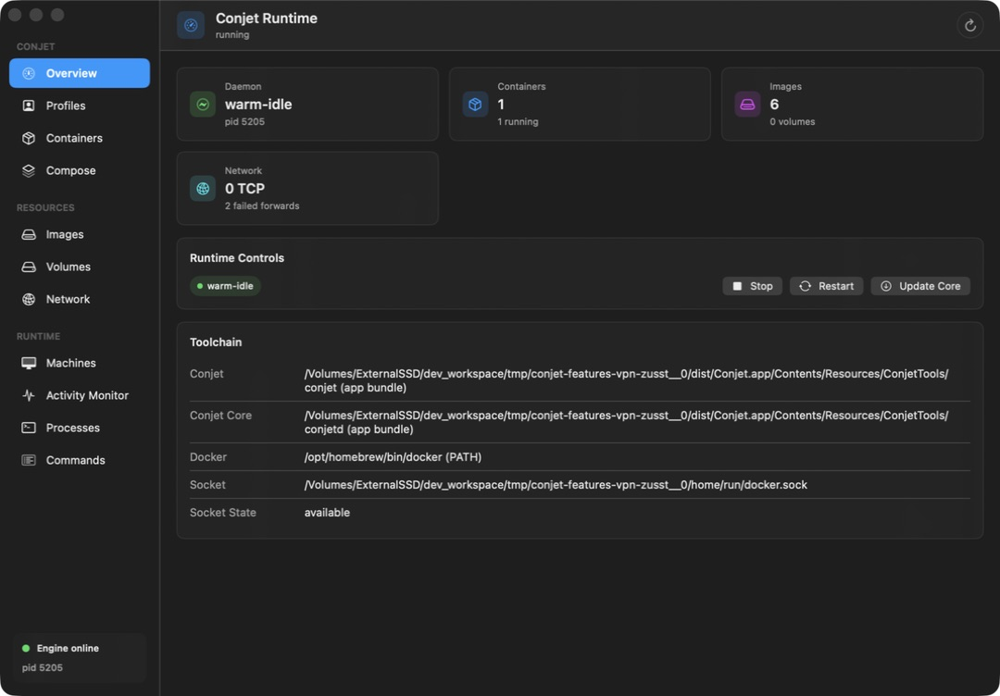

### 2. Containers and terminal — working basic operations, port health gap

Inventory and details agree with Docker. Terminal input/output worked; the Info
tab should also show failed host publication. Terminal accessibility needs deeper
testing.

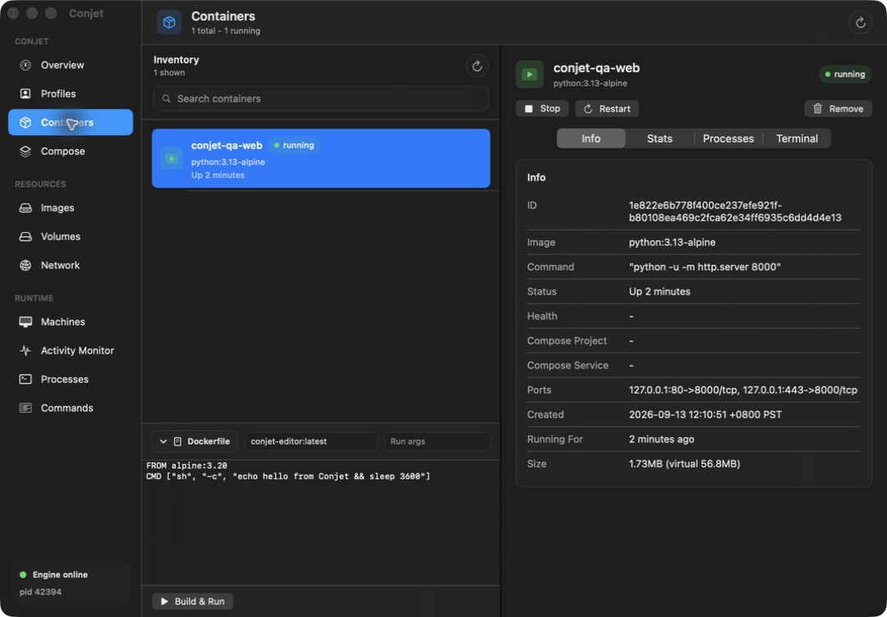
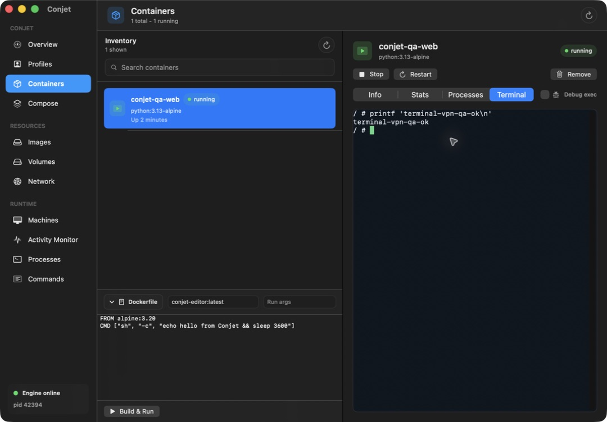

### 3. Images — working inventory, readable detail

The populated inventory shows the QA build and pulled images with distinct tags.
Long identifiers truncate in summary rows; the detail pane provides more space.

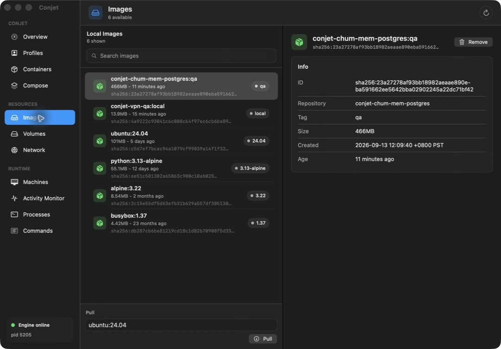

### 4. Volumes — clear empty state, destructive-action clarity needed

The baseline empty inventory matches Docker. Named-volume persistence was tested
through the API; every GUI removal/prune path was not exercised. Add clear scope
and confirmation for data-deleting actions.

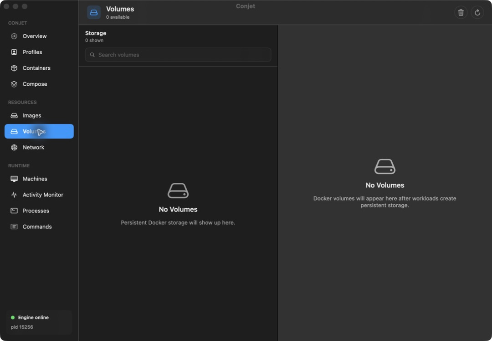

### 5. Network — improved and VPN-validated for IPv4

The new active egress description and event-specific badge separate two different
conditions. Policy pickers are readable. Low-port authorization remains pending;
small metric cards still truncate some details.

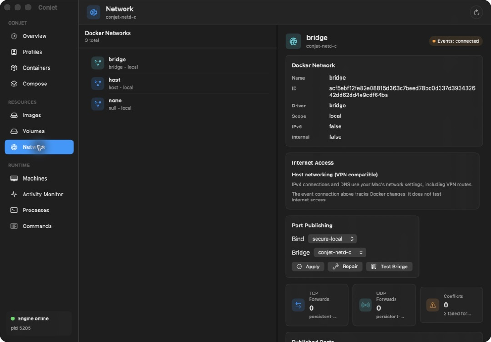

### 6. Machines — lifecycle works; asynchronous subtitle can be stale

The QA Docker-ready startup reports readiness correctly. The baseline control-ready
message stayed at asynchronous warming. This screen manages the profile's runtime
VM, not an arbitrary multi-hypervisor machine fleet.

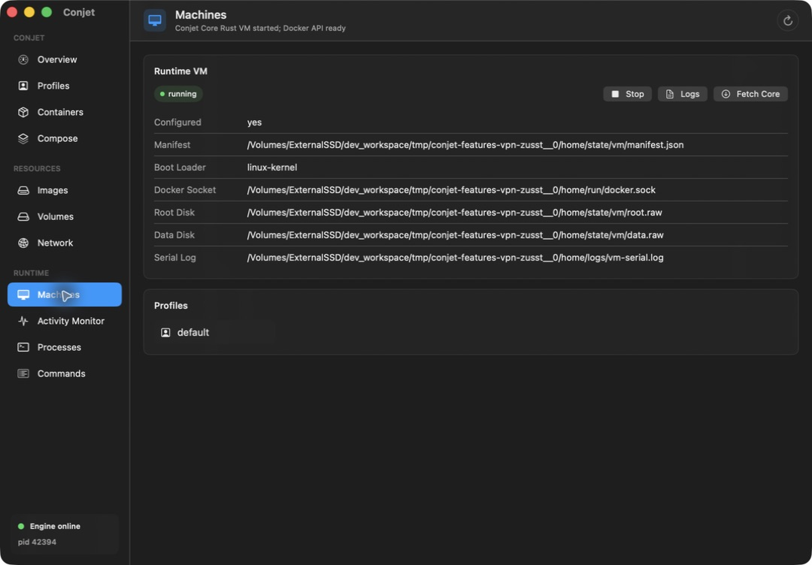

### 7. Activity Monitor — live sample shown; navigation truncates

CPU/memory/network/PID values appear for the running container. The selected
sidebar title truncates. Low displayed CPU in this capture is not a power or
performance benchmark.

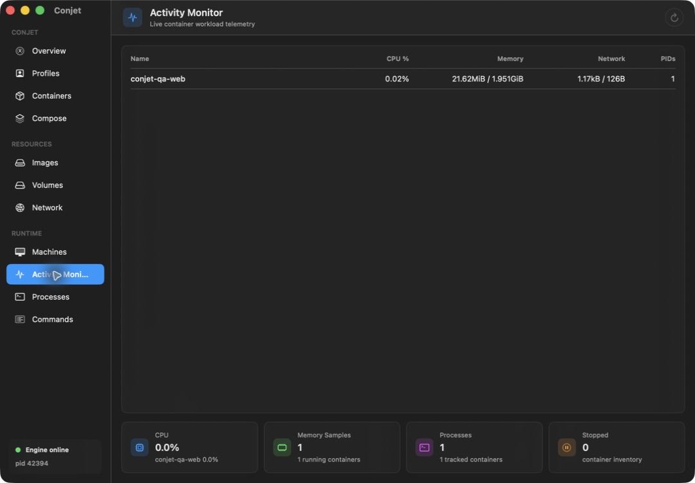

### 8. Processes — works for this workload; coverage cap needs disclosure

The container server and terminal shell appear. The first-twelve-container cap
and sequential timeouts are the main correctness/performance concerns.

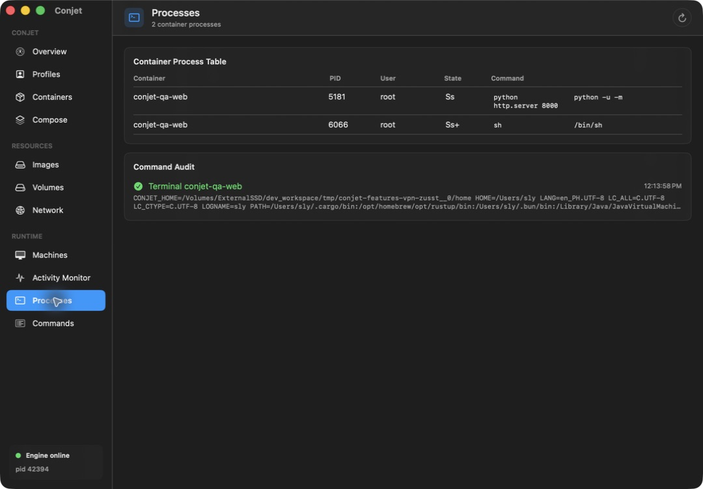

### 9. Commands — useful record; terminal launch semantics need clearer copy

The command/output panels show the launched session. Success here describes
launching the terminal, not completion of everything typed into it. Long command
strings need a readable expansion.

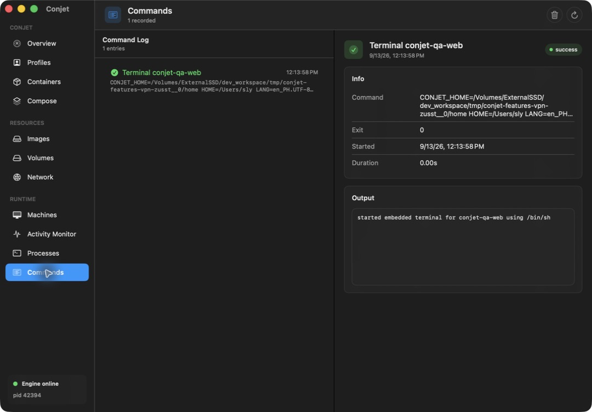

### 10. Compose — backend works; project selection needs validation

The baseline UI exposes Up with `/` as the directory. The separate isolated
Compose tests cover publication and chum-mem Postgres, not this complete GUI flow.
Add a picker, selected-file preview, and config validation.

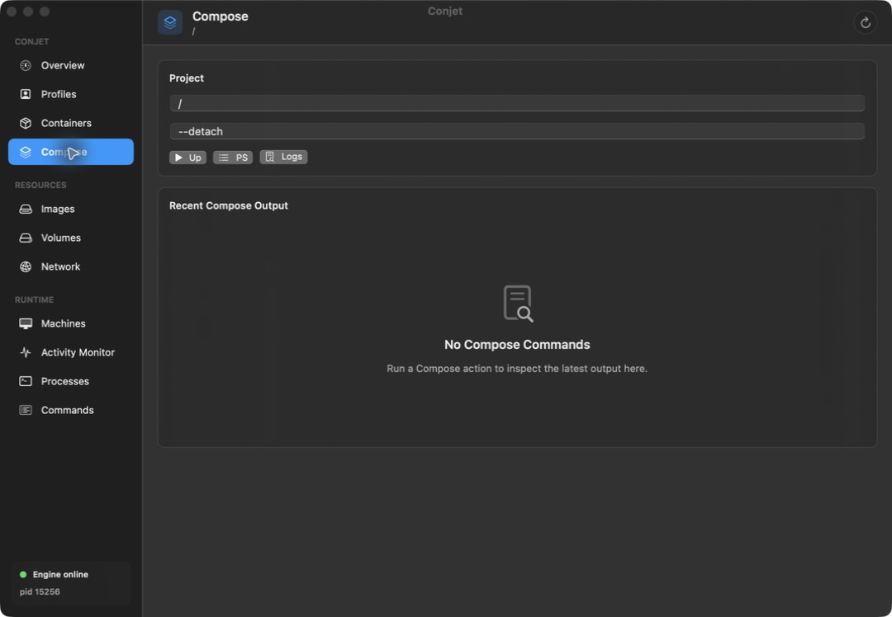

### 11. Profiles — egress choice added and preserved

Internet Access is separate from port bind/proxy/bridge settings and explains
when a change applies. Host Mounts still needs the actual Rust sharing support
described above; a checked toggle alone is insufficient.

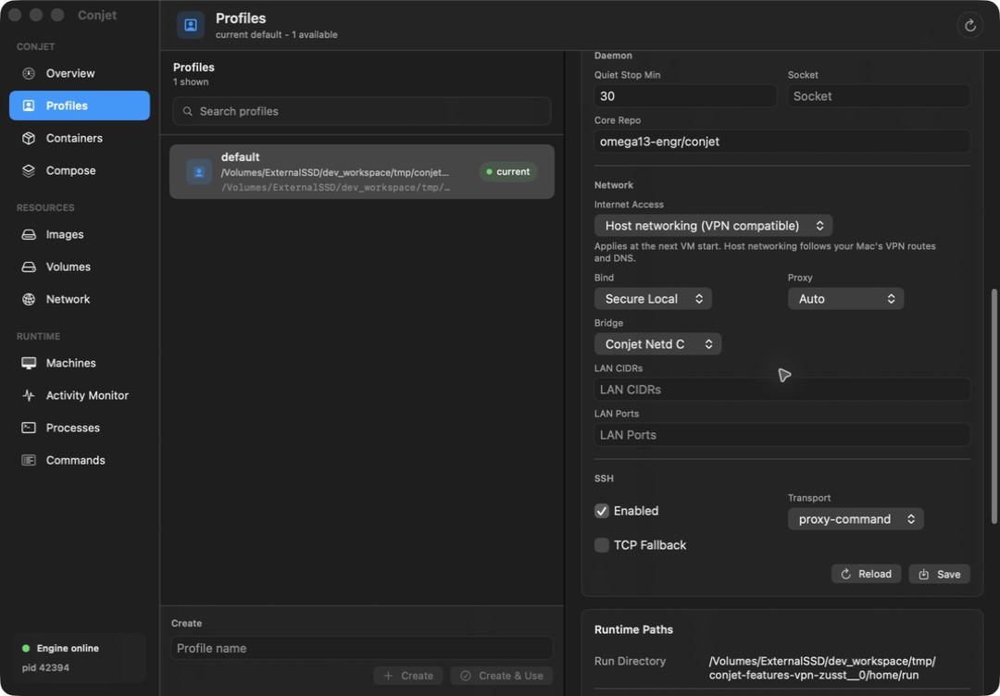

Evidence and relevant errors: [QA record](qa/runtime-features-2026-09-13/evidence.json)
and [retained logs](qa/runtime-features-2026-09-13/logs).

## Design references

Host socket egress follows the approach documented by
[Docker for its macOS backend](https://docs.docker.com/desktop/features/networking/):
the host backend creates normal TCP/IP connections visible to VPN/firewall policy.
This supports the design choice; the connected-VPN observations above supply
Conjet-specific evidence. The reused stack and its capabilities are described in
[gvisor-tap-vsock v0.8.9](https://github.com/containers/gvisor-tap-vsock/tree/v0.8.9).
